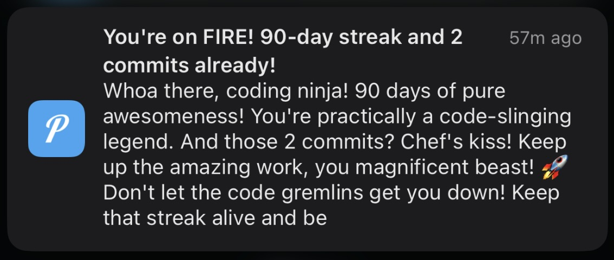

# One Percent Better

A personalized tracker for GitHub commits and habits.

Built using Spring Boot + Java for the backend and React Router framework + TypeScript for the UI. Used Gemini as LLM for personalized coaching.

## Motivation

I wanted to make myself to build and push something to GitHub everyday. I was inspired by Duolingo's streak system and sending 'pushy' notifications. I decided to create an app that replicates this system for GitHub commits and expanded the idea to habits. Additionally, I would also like to view statistics to analyze my progress so far.

## Screenshots

